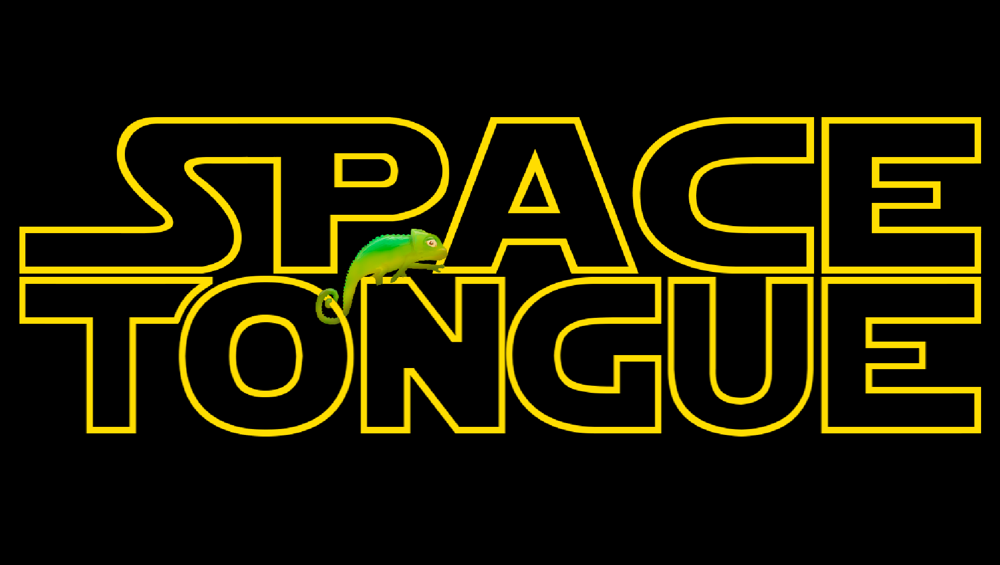
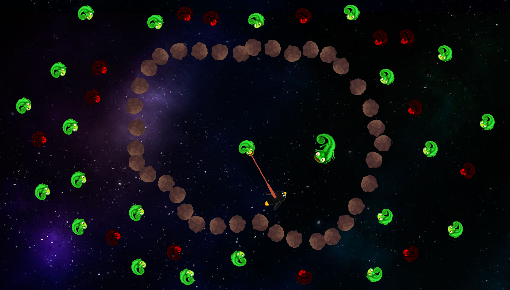

# Space Tongue

From a GameJam in VGA, we made this game, the game was build in 48 hours (after that we made some improvements)
Hope you can enjoy this funny game.

To use it just open the .pro file with qtcreator, set the debug file, and make a softlink of the resources to put in the debug file.

v0.1.

## Controls
### Menu
+ Left click to the number to start a level.
+ Left click at the chameleons to go to a previus or next level.
+ Press Space to start the level editor

### Ingame
+ Left click to the chameleons to lick the spaceship
+ Press R to restart the level
+ Press Escape to start or quit the menu

### Level Editor
+ Press Ctrl + Q to quit the level editor
+ Press Number 1 to select the penguin.
+ Press Number 2 to select the goal.
+ Press Number 3, 4, 5 to select green chameleon, red chameleon, or an obstacle.
+ Press Escape to unselect.
+ Press M to go to the next level.
+ Press N to go to the previous level.
+ Toggle Space and click and move the mouse to move the camera
+ Rotate the mouse wheel to zoom in or zoom out
+ Press Ctrl + S to save the level to your levelsfile
+ Press Ctrl + N to make a new level
